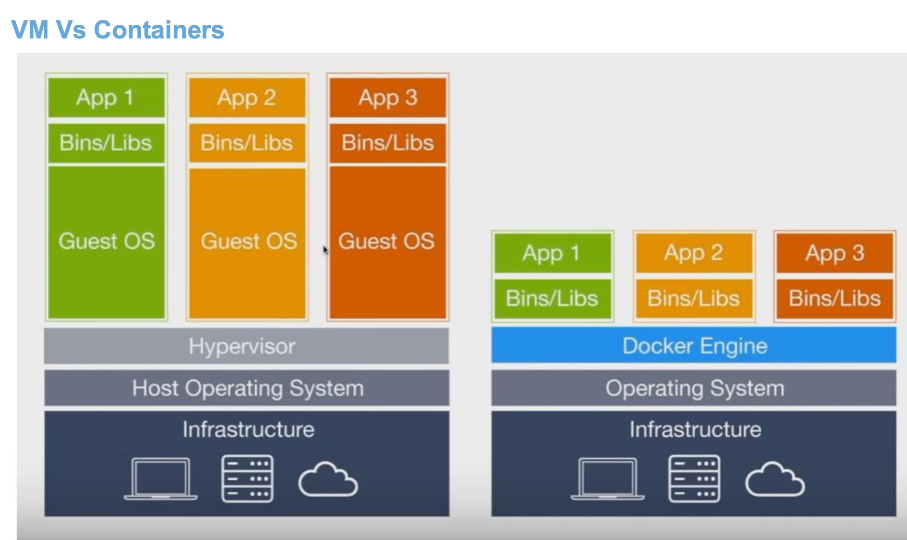
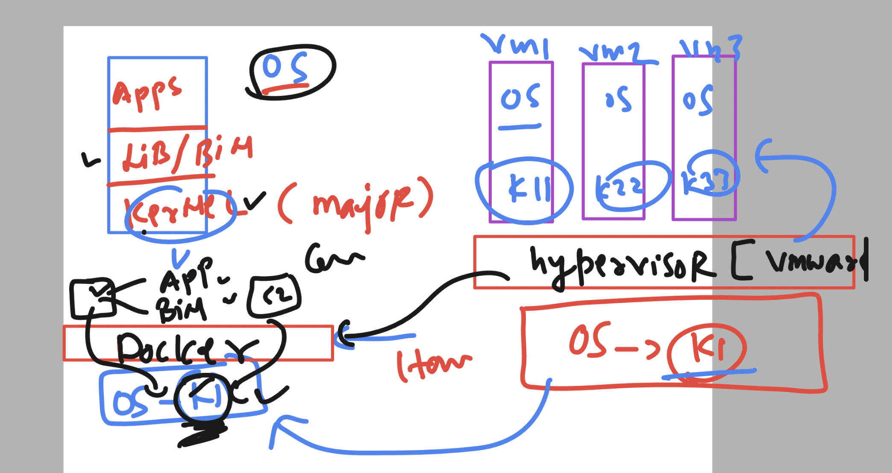
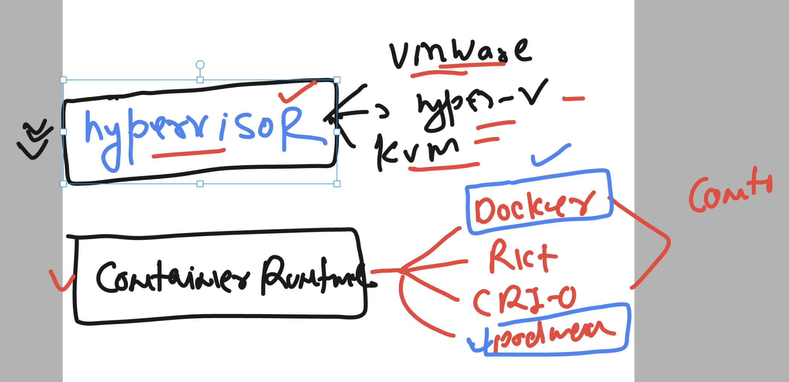
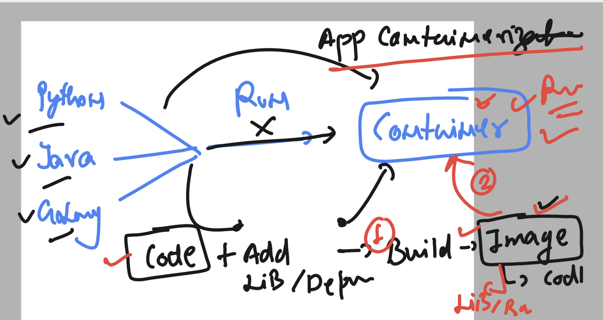
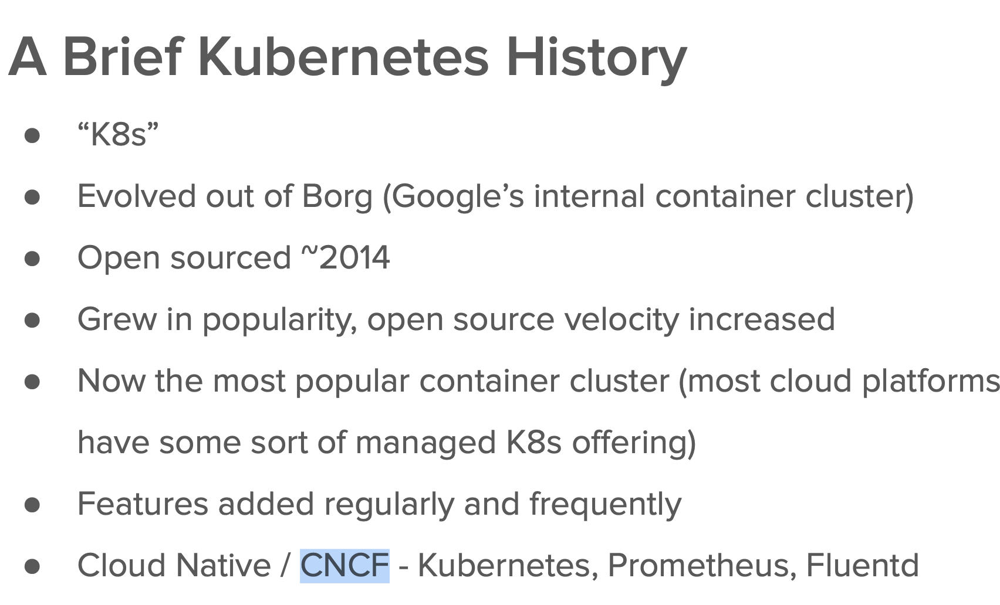
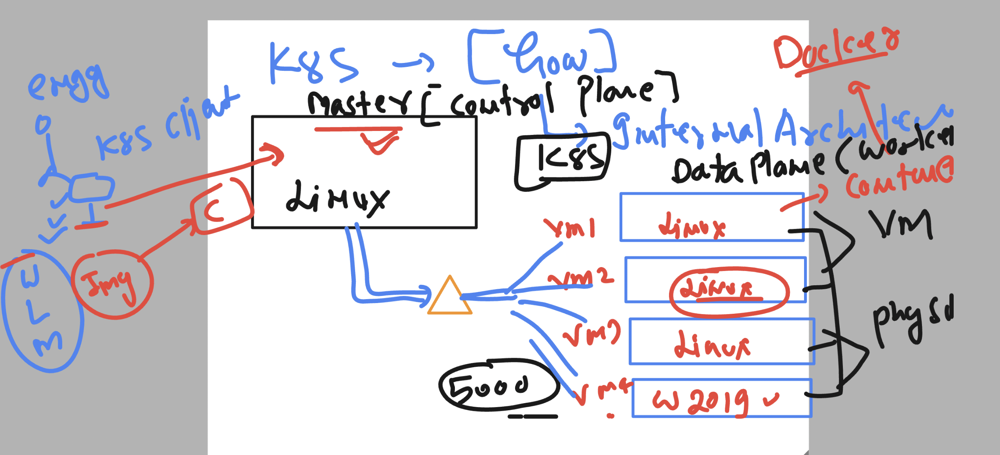
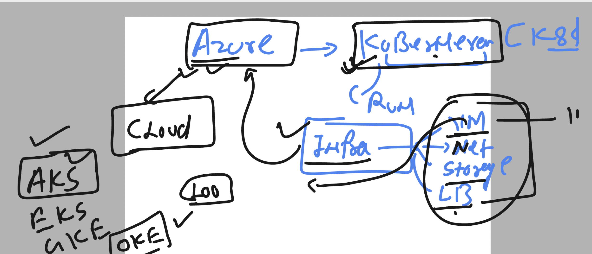
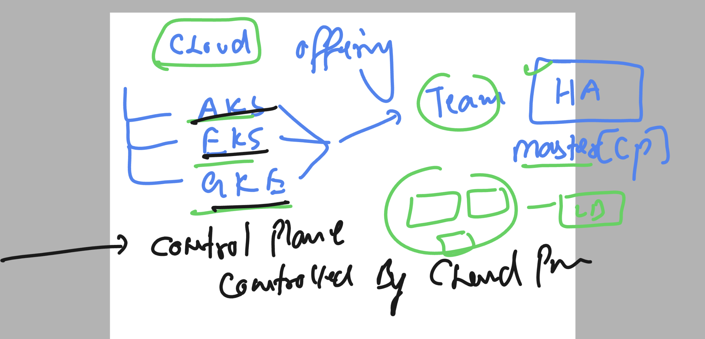

### Container basics 



### container understanding 



### hypervisor vs container runtime



### app containerization --process



### Introduction to k8s 



## k8s architecture 

### High level arch 1 



### kubernetes with cloud env 



### cloud service -- cloud managed control plane 



### checking on k8s client machine for required softwares 

```
PS C:\Users\humanfirmware> kubectl.exe  version --client
Client Version: v1.28.1
Kustomize Version: v5.0.4-0.20230601165947-6ce0bf390ce3


PS C:\Users\humanfirmware>
PS C:\Users\humanfirmware>
PS C:\Users\humanfirmware> az  version
{
  "azure-cli": "2.52.0",
  "azure-cli-core": "2.52.0",
  "azure-cli-telemetry": "1.1.0",
  "extensions": {}
}

```

