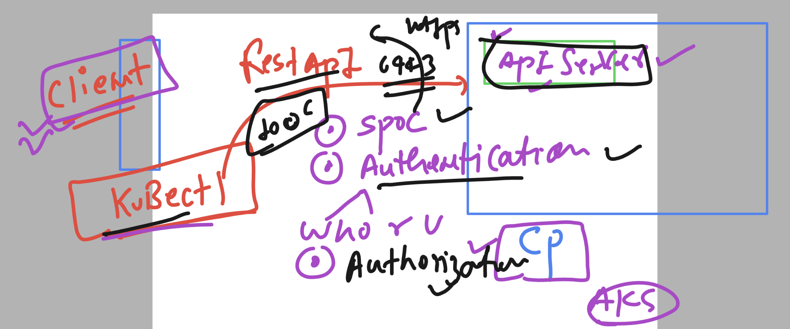
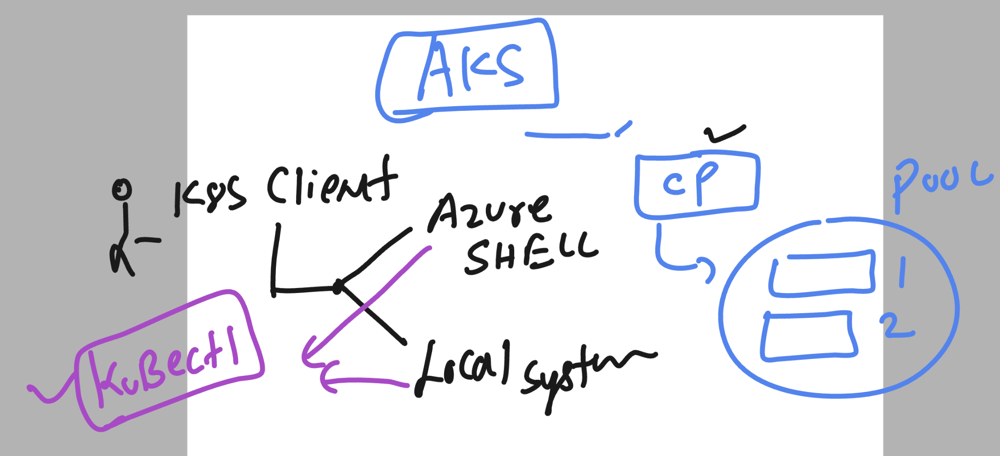

### Container basics 


### container understanding 


### hypervisor vs container runtime


### app containerization --process


### Introduction to k8s 


## k8s architecture 

### High level arch 1 


### kubernetes with cloud env 


### cloud service -- cloud managed control plane 


### checking on k8s client machine for required softwares 

```
PS C:\Users\humanfirmware> kubectl.exe  version --client
Client Version: v1.28.1
Kustomize Version: v5.0.4-0.20230601165947-6ce0bf390ce3


PS C:\Users\humanfirmware>
PS C:\Users\humanfirmware>
PS C:\Users\humanfirmware> az  version
{
  "azure-cli": "2.52.0",
  "azure-cli-core": "2.52.0",
  "azure-cli-telemetry": "1.1.0",
  "extensions": {}
}

```

# Control plane components 

### APiserver 



### connecting to aks control plane 



### connecting aks control plane from local windows system 

```
PS C:\Users\humanfirmware> az login
A web browser has been opened at https://login.microsoftonline.com/organizations/oauth2/v2.0/authorize. Please continue the login in the web browser. If no web browser is available or if the web browser fails to open, use device code flow with `az login --use-device-code`.
[
  {
    "cloudName": "AzureCloud",
    "homeTenantId": "199ee0d2-f16c-4bcc-8282-a04937c02e5d",
    "id": "278980ef-cfef-4a86-b0e6-0bc9e1286a41",
    "isDefault": true,
    "managedByTenants": [],
    "name": "Pay-As-You-Go",
    "state": "Enabled",
    "tenantId": "199ee0d2-f16c-4bcc-8282-a04937c02e5d",
    "user": {
      "name": "learntechbyme@gmail.com",
      "type": "user"
    }
  }
]
PS C:\Users\humanfirmware> az account set --subscription bc9e1286


PS C:\Users\humanfirmware> az aks get-credentials --resource-group aks-training --name huokk
Merged "ashu-cluster1" as current context in C:\Users\humanfirmware\.kube\config
PS C:\Users\humanfirmware>
```

### sending request to the control plane 

```
PS C:\Users\humanfirmware> kubectl.exe  cluster-info
Kubernetes control plane is running at https://ashu-cluster1-dns-5g84jo3q.hcp.centralindia.azmk8s.io:443
CoreDNS is running at https://ashu-cluster1-dns-5g84jo3q.hcp.centralindia.azmk8s.io:443/api/v1/namespaces/kube-system/services/kube-dns:dns/proxy                                                                                               Metrics-server is running at https://ashu-cluster1-dns-5g84jo3q.hcp.centralindia.azmk8s.io:443/api/v1/namespaces/kube-system/services/https:metrics-server:/proxy

To further debug and diagnose cluster problems, use 'kubectl cluster-info dump'.
PS C:\Users\humanfirmware>
PS C:\Users\humanfirmware>
PS C:\Users\humanfirmware>
PS C:\Users\humanfirmware> kubectl.exe  get  nodes
NAME                                STATUS   ROLES   AGE   VERSION
aks-agentpool-25623780-vmss000000   Ready    agent   14m   v1.26.6
aks-agentpool-25623780-vmss000001   Ready    agent   14m   v1.26.6
PS C:\Users\humanfirmware>

```
