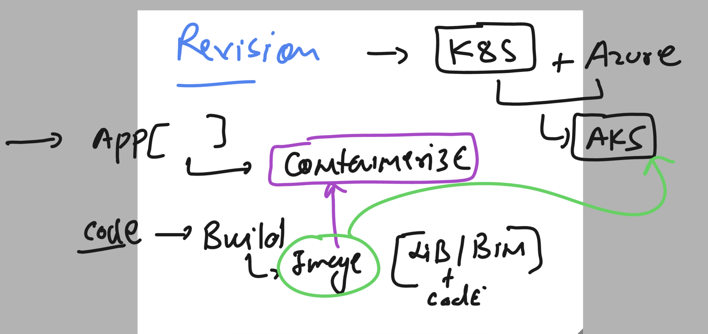

### Revision of containerization of app



### k8s architecture understanding 


### etcd the nosql db of control plane


### connecting to k8s cluster using kubectl -- verify 

```
ashutoshh [ ~ ]$ kubectl  version --client 
Client Version: v1.28.1
Kustomize Version: v5.0.4-0.20230601165947-6ce0bf390ce3
ashutoshh [ ~ ]$ 
ashutoshh [ ~ ]$ 
ashutoshh [ ~ ]$ kubectl  cluster-info 
Kubernetes control plane is running at https://aks-ashutoshh-dns-r0ws59xp.hcp.centralindia.azmk8s.io:443
CoreDNS is running at https://aks-ashutoshh-dns-r0ws59xp.hcp.centralindia.azmk8s.io:443/api/v1/namespaces/kube-system/services/kube-dns:dns/proxy
Metrics-server is running at https://aks-ashutoshh-dns-r0ws59xp.hcp.centralindia.azmk8s.io:443/api/v1/namespaces/kube-system/services/https:metrics-server:/proxy

To further debug and diagnose cluster problems, use 'kubectl cluster-info dump'.
ashutoshh [ ~ ]$ 
ashutoshh [ ~ ]$ 
ashutoshh [ ~ ]$ kubectl  version 
Client Version: v1.28.1
Kustomize Version: v5.0.4-0.20230601165947-6ce0bf390ce3
Server Version: v1.26.6
WARNING: version difference between client (1.28) and server (1.26) exceeds the supported minor version skew of +/-1
ashutoshh [ ~ ]$ kubectl  version  -o json 
{
  "clientVersion": {
    "major": "1",
    "minor": "28",
    "gitVersion": "v1.28.1",
    "gitCommit": "8dc49c4b984b897d423aab4971090e1879eb4f23",
    "gitTreeState": "clean",
```

### checking nodes 

```
ashutoshh [ ~ ]$ kubectl    get  nodes
NAME                                STATUS   ROLES   AGE   VERSION
aks-agentpool-18505526-vmss000000   Ready    agent   79m   v1.26.6
aks-agentpool-18505526-vmss000001   Ready    agent   79m   v1.26.6
```


