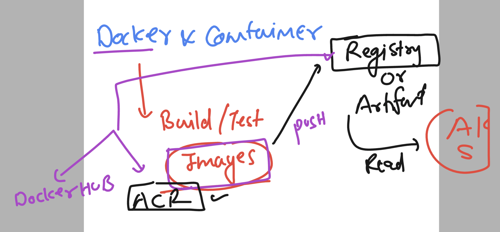

### Revision of containerization of app


### k8s architecture understanding 


### etcd the nosql db of control plane


### connecting to k8s cluster using kubectl -- verify 

```
ashutoshh [ ~ ]$ kubectl  version --client 
Client Version: v1.28.1
Kustomize Version: v5.0.4-0.20230601165947-6ce0bf390ce3
ashutoshh [ ~ ]$ 
ashutoshh [ ~ ]$ 
ashutoshh [ ~ ]$ kubectl  cluster-info 
Kubernetes control plane is running at https://aks-ashutoshh-dns-r0ws59xp.hcp.centralindia.azmk8s.io:443
CoreDNS is running at https://aks-ashutoshh-dns-r0ws59xp.hcp.centralindia.azmk8s.io:443/api/v1/namespaces/kube-system/services/kube-dns:dns/proxy
Metrics-server is running at https://aks-ashutoshh-dns-r0ws59xp.hcp.centralindia.azmk8s.io:443/api/v1/namespaces/kube-system/services/https:metrics-server:/proxy

To further debug and diagnose cluster problems, use 'kubectl cluster-info dump'.
ashutoshh [ ~ ]$ 
ashutoshh [ ~ ]$ 
ashutoshh [ ~ ]$ kubectl  version 
Client Version: v1.28.1
Kustomize Version: v5.0.4-0.20230601165947-6ce0bf390ce3
Server Version: v1.26.6
WARNING: version difference between client (1.28) and server (1.26) exceeds the supported minor version skew of +/-1
ashutoshh [ ~ ]$ kubectl  version  -o json 
{
  "clientVersion": {
    "major": "1",
    "minor": "28",
    "gitVersion": "v1.28.1",
    "gitCommit": "8dc49c4b984b897d423aab4971090e1879eb4f23",
    "gitTreeState": "clean",
```

### checking nodes 

```
ashutoshh [ ~ ]$ kubectl    get  nodes
NAME                                STATUS   ROLES   AGE   VERSION
aks-agentpool-18505526-vmss000000   Ready    agent   79m   v1.26.6
aks-agentpool-18505526-vmss000001   Ready    agent   79m   v1.26.6
```
### to deploy app (container images ) they must be present in some Registry 



### ANY container image will be deployed in kubernetes in the form of POd 


### Deploy a pod manifest in AKS using kubectl 

```
ashutoshh [ ~ ]$ ls
ashupod1.yaml  clouddrive
ashutoshh [ ~ ]$ 
ashutoshh [ ~ ]$ kubectl  get  pods
No resources found in default namespace.
ashutoshh [ ~ ]$ 
ashutoshh [ ~ ]$ kubectl   create  -f  ashupod1.yaml  
pod/ashupod-1 created
ashutoshh [ ~ ]$ 
ashutoshh [ ~ ]$ kubectl  get  pods
NAME        READY   STATUS              RESTARTS   AGE
ashupod-1   0/1     ContainerCreating   0          8s
ashutoshh [ ~ ]$ kubectl  get  pods
NAME        READY   STATUS    RESTARTS   AGE
ashupod-1   1/1     Running   0          22s
ashutoshh [ ~ ]$ 

```
### chekcing pod scheduling details

```
shutoshh [ ~ ]$ kubectl   get nodes
NAME                                STATUS   ROLES   AGE    VERSION
aks-agentpool-18505526-vmss000000   Ready    agent   169m   v1.26.6
aks-agentpool-18505526-vmss000001   Ready    agent   169m   v1.26.6


ashutoshh [ ~ ]$ 
ashutoshh [ ~ ]$ kubectl   get  pods  -o wide
NAME        READY   STATUS    RESTARTS   AGE     IP           NODE                                NOMINATED NODE   READINESS GATES
ashupod-1   1/1     Running   0          5m12s   10.244.1.6   aks-agentpool-18505526-vmss000000   <none>           <none>
ashutoshh [ ~ ]$ 

```

### detail info about pod 

```
ashutoshh [ ~ ]$ kubectl   describe  pod  ashupod-1  
Name:             ashupod-1
Namespace:        default
Priority:         0
Service Account:  default
Node:             aks-agentpool-18505526-vmss000000/10.224.0.4
Start Time:       Tue, 12 Sep 2023 07:49:24 +0000
Labels:           <none>
Annotations:      cni.projectcalico.org/containerID: d7632b661c94ac0050b7f31ba2ea81fb802d872d0486ef1fde5e1fd5764becd7
                  cni.projectcalico.org/podIP: 10.244.1.6/32
                  cni.projectcalico.org/podIPs: 10.244.1.6/32
Status:           Running
IP:               10.244.1.6
IPs:
  IP:  10.244.1.6
Containers:
```

### checking logs 

```
ashutoshh [ ~ ]$ kubectl logs  ashupod-1
/docker-entrypoint.sh: /docker-entrypoint.d/ is not empty, will attempt to perform configuration
/docker-entrypoint.sh: Looking for shell scripts in /docker-entrypoint.d/
/docker-entrypoint.sh: Launching /docker-entrypoint.d/10-listen-on-ipv6-by-default.sh
10-listen-on-ipv6-by-default.sh: info: Getting the checksum of /etc/nginx/conf.d/default.conf
10-listen-on-ipv6-by-default.sh: info: Enabled listen on IPv6 in /etc/nginx/conf.d/default.conf
/docker-entrypoint.sh: Sourcing /docker-entrypoint.d/15-local-resolvers.envsh
/docker-entrypoint.sh: Launching /docker-entrypoint.d/20-envsubst-on-templates.sh
```

### sending a delete request to pod

```
ashutoshh [ ~ ]$ kubectl  get  pods
NAME        READY   STATUS    RESTARTS   AGE
ashupod-1   1/1     Running   0          10m
ashutoshh [ ~ ]$ 
ashutoshh [ ~ ]$ 
ashutoshh [ ~ ]$ kubectl delete pod  ashupod-1
pod "ashupod-1" deleted
ashutoshh [ ~ ]$ 
ashutoshh [ ~ ]$ 
ashutoshh [ ~ ]$ kubectl  get pods
No resources found in default namespace.
```


