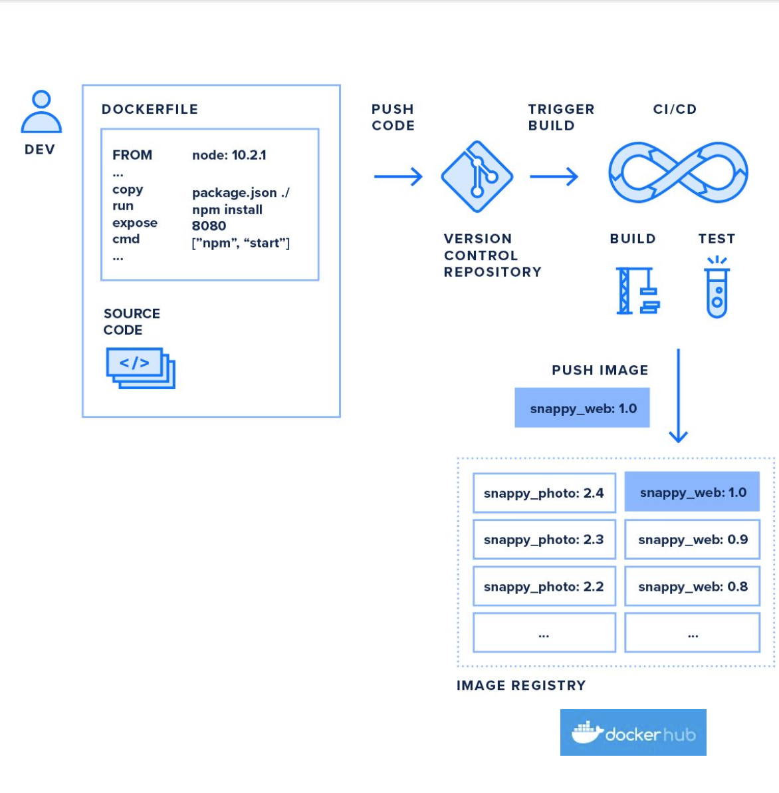
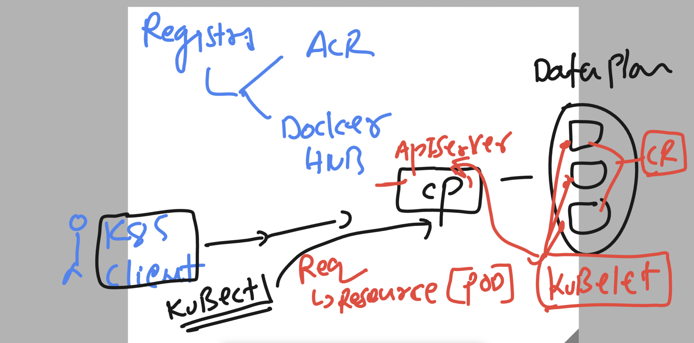
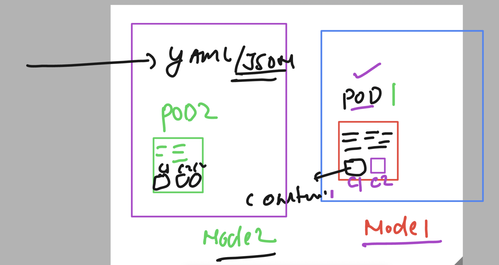

### app containerization 



### k8s client to deploy app 



### more details about pods 



### auto generate pod manifest 

```
2 kubectl run  ashupodnew  --image=dockerashu/ashu-customer1:releasev1  --port 80 --dry-run=client   -o yaml
  13 kubectl run  ashupodnew  --image=dockerashu/ashu-customer1:releasev1  --port 80 --dry-run=client   -o yaml   >newpod.yaml
  14 kubectl run  ashupodnew  --image=dockerashu/ashu-customer1:releasev1  --port 80 --dry-run=client   -o yaml


PS C:\Users\humanfirmware\Desktop\my-yaml-manifest>
PS C:\Users\humanfirmware\Desktop\my-yaml-manifest>
PS C:\Users\humanfirmware\Desktop\my-yaml-manifest>
PS C:\Users\humanfirmware\Desktop\my-yaml-manifest> kubectl create  -f  newpod.yaml 
pod/ashupodnew created
PS C:\Users\humanfirmware\Desktop\my-yaml-manifest> kubectl get pods
NAME         READY   STATUS    RESTARTS   AGE
ashupodnew   1/1     Running   0          4s
PS C:\Users\humanfirmware\Desktop\my-yaml-manifest> kubectl delete -f newpod.yaml
pod "ashupodnew" deleted

```
