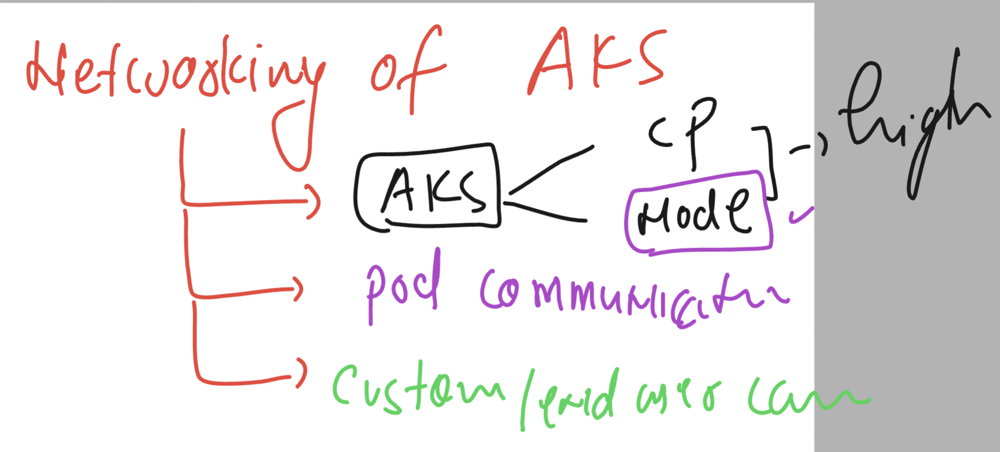
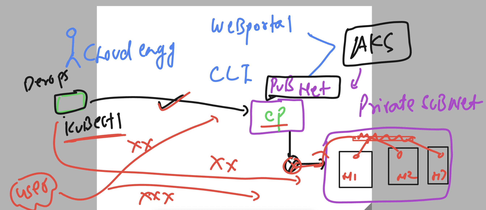
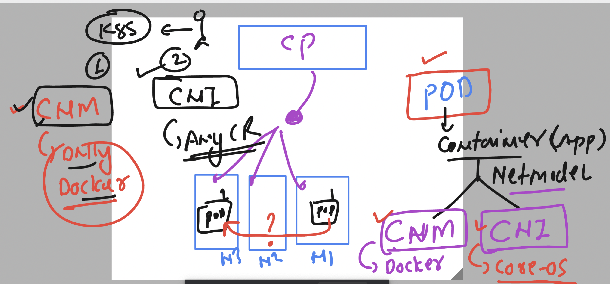
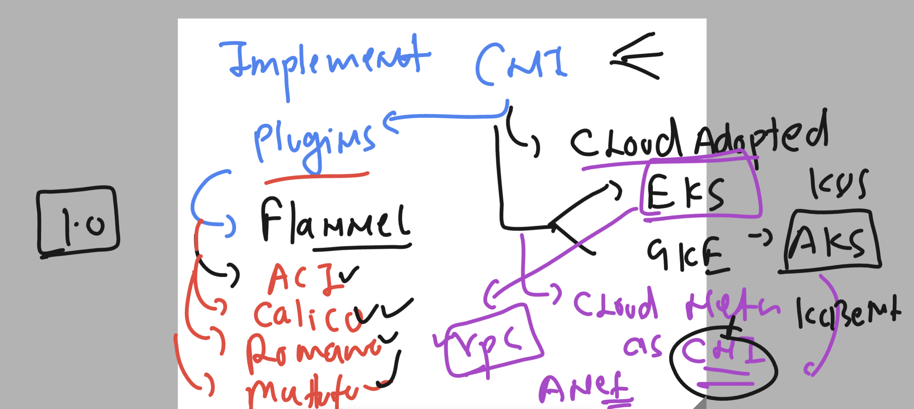
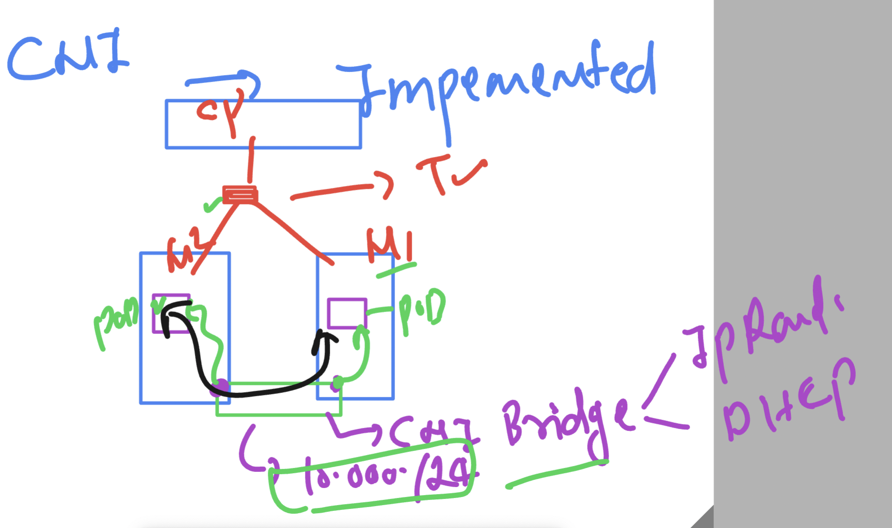
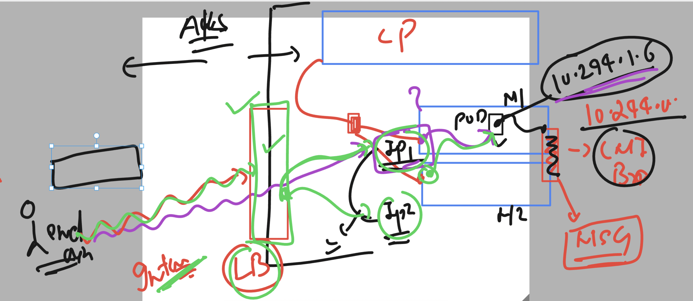
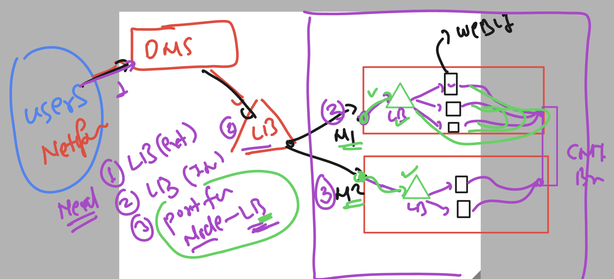
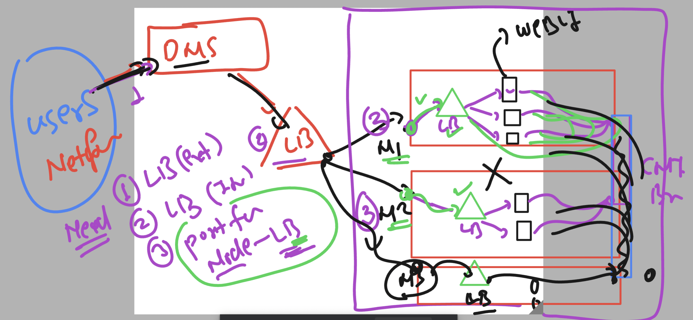

### app containerization 


### k8s client to deploy app 


### more details about pods 


### auto generate pod manifest 

```
2 kubectl run  ashupodnew  --image=dockerashu/ashu-customer1:releasev1  --port 80 --dry-run=client   -o yaml
  13 kubectl run  ashupodnew  --image=dockerashu/ashu-customer1:releasev1  --port 80 --dry-run=client   -o yaml   >newpod.yaml
  14 kubectl run  ashupodnew  --image=dockerashu/ashu-customer1:releasev1  --port 80 --dry-run=client   -o yaml


PS C:\Users\humanfirmware\Desktop\my-yaml-manifest>
PS C:\Users\humanfirmware\Desktop\my-yaml-manifest>
PS C:\Users\humanfirmware\Desktop\my-yaml-manifest>
PS C:\Users\humanfirmware\Desktop\my-yaml-manifest> kubectl create  -f  newpod.yaml 
pod/ashupodnew created
PS C:\Users\humanfirmware\Desktop\my-yaml-manifest> kubectl get pods
NAME         READY   STATUS    RESTARTS   AGE
ashupodnew   1/1     Running   0          4s
PS C:\Users\humanfirmware\Desktop\my-yaml-manifest> kubectl delete -f newpod.yaml
pod "ashupodnew" deleted

```
## Networking in k8s -- using AKS 



## AKS networking phase 1



### for pod container communication in k8s we will choose CNI model 



### pod networking with and without cloud 



### CNi bridge to IP address pod 



### checking pod IP address just after deploy 

```
PS C:\Users\humanfirmware\Desktop\my-yaml-manifest> kubectl create -f  ashupod1.yaml
pod/ashupod111 created
PS C:\Users\humanfirmware\Desktop\my-yaml-manifest>                                                                                                          PS C:\Users\humanfirmware\Desktop\my-yaml-manifest> kubectl get pods                                                                                         NAME         READY   STATUS    RESTARTS   AGE                                                                                                                ashupod111   1/1     Running   0          5s                                                                                                                 
PS C:\Users\humanfirmware\Desktop\my-yaml-manifest> kubectl get pods  -o wide
NAME         READY   STATUS    RESTARTS   AGE   IP           NODE                                NOMINATED NODE   READINESS GATES
ashupod111   1/1     Running   0          22s   10.244.1.4   aks-agentpool-18505526-vmss000003   <none>           <none>
PS C:\Users\humanfirmware\Desktop\my-yaml-manifest> kubectl create -f .\newpod.yaml
pod/ashupodnew created
PS C:\Users\humanfirmware\Desktop\my-yaml-manifest> kubectl get pods  -o wide      
NAME         READY   STATUS    RESTARTS   AGE   IP           NODE                                NOMINATED NODE   READINESS GATES
ashupod111   1/1     Running   0          55s   10.244.1.4   aks-agentpool-18505526-vmss000003   <none>           <none>
ashupodnew   1/1     Running   0          2s    10.244.1.5   aks-agentpool-18505526-vmss000003   <none>           <none>
PS C:\Users\humanfirmware\Desktop\my-yaml-manifest> kubectl describe pod  ashupod111
Name:             ashupod111
Namespace:        default
Priority:         0
Service Account:  default
Node:             aks-agentpool-18505526-vmss000003/10.224.0.5
Start Time:       Wed, 13 Sep 2023 13:02:41 +0530
Labels:           <none>
Annotations:      cni.projectcalico.org/containerID: 6a41c2760e675b05fec50abee7442e907ca632b1dc931ba8d3a899078abad345
                  cni.projectcalico.org/podIP: 10.244.1.4/32
                  cni.projectcalico.org/podIPs: 10.244.1.4/32
```

### Load balancer as Internet facing entity 



### end user to k8s pod networking show 



### understanding it 




