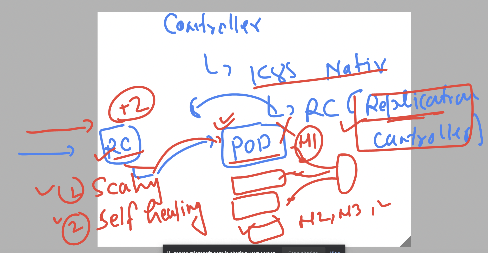
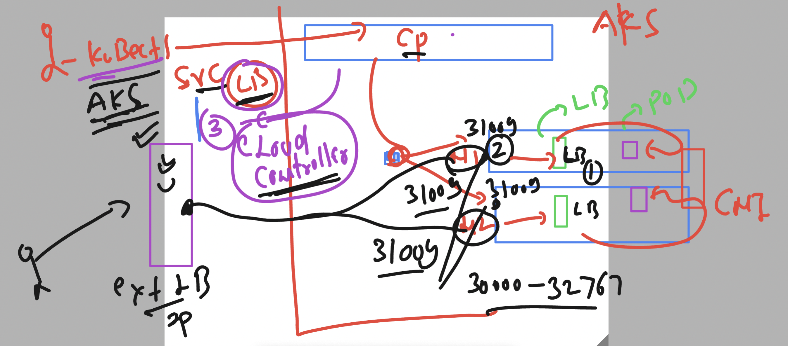

### Revision 


### on client machine location where k8s control plane creds are stored


### controller in k8s 


## Introduction to RC 



### sample RC manifest file 

```
apiVersion: v1
kind: ReplicationController
metadata:
  name: ashu-rc1 # name of my RC 
spec:
  replicas: 1 # number of pod we want 
  template: # pod info 
    metadata:
      labels:
        run: ashupodnew
    spec:
      containers:
      - image: dockerashu/ashu-customer1:releasev1
        name: ashupodnew
        ports:
        - containerPort: 80

```

### deploy manfiest

```
PS C:\Users\humanfirmware\Desktop\my-yaml-manifest> kubectl   create  -f   ashu-rc.yaml 
replicationcontroller/ashu-rc1 created
PS C:\Users\humanfirmware\Desktop\my-yaml-manifest> 
PS C:\Users\humanfirmware\Desktop\my-yaml-manifest> kubectl  get  replicationcontroller
NAME       DESIRED   CURRENT   READY   AGE
ashu-rc1   1         1         1       16s
PS C:\Users\humanfirmware\Desktop\my-yaml-manifest> 
PS C:\Users\humanfirmware\Desktop\my-yaml-manifest> kubectl  get   rc                  
NAME       DESIRED   CURRENT   READY   AGE
ashu-rc1   1         1         1       21s
PS C:\Users\humanfirmware\Desktop\my-yaml-manifest> 
PS C:\Users\humanfirmware\Desktop\my-yaml-manifest> kubectl   get  pods
NAME             READY   STATUS    RESTARTS   AGE
ashu-rc1-cdl69   1/1     Running   0          40s
PS C:\Users\humanfirmware\Desktop\my-yaml-manifest> kubectl   get  pods -o wide
NAME             READY   STATUS    RESTARTS   AGE   IP           NODE                                NOMINATED NODE   READINESS GATES
ashu-rc1-cdl69   1/1     Running   0          47s   10.244.1.2   aks-agentpool-18505526-vmss000004   <none>           <none>
PS C:\Users\humanfirmware\Desktop\my-yaml-manifest> 
```


### self healing of pod due to RC

```
S C:\Users\humanfirmware\Desktop\my-yaml-manifest> 
PS C:\Users\humanfirmware\Desktop\my-yaml-manifest> kubectl delete pod  ashu-rc1-cdl69
pod "ashu-rc1-cdl69" deleted
PS C:\Users\humanfirmware\Desktop\my-yaml-manifest> kubectl get  pods -o wide
NAME             READY   STATUS    RESTARTS   AGE   IP           NODE                                NOMINATED NODE   READINESS GATES
ashu-rc1-fr9cl   1/1     Running   0          34s   10.244.1.3   aks-agentpool-18505526-vmss000004   <none>           <none>
PS C:\Users\humanfirmware\Desktop\my-yaml-manifest> 
```

### scaling pod horizentally using manifest file 

```
PS C:\Users\humanfirmware\Desktop\my-yaml-manifest> kubectl apply  -f  .\ashu-rc.yaml
Warning: resource replicationcontrollers/ashu-rc1 is missing the kubectl.kubernetes.io/last-applied-configuration annotation which is required by kubectl apply. kubectl apply should only be used on resources created declaratively by either kubectl create --save-config or kubectl apply. The missing annotation will be patched automatically.
replicationcontroller/ashu-rc1 configured
PS C:\Users\humanfirmware\Desktop\my-yaml-manifest> 
PS C:\Users\humanfirmware\Desktop\my-yaml-manifest> kubectl  get  rc
NAME       DESIRED   CURRENT   READY   AGE
ashu-rc1   3         3         2       15m
PS C:\Users\humanfirmware\Desktop\my-yaml-manifest> kubectl  get  rc
NAME       DESIRED   CURRENT   READY   AGE
ashu-rc1   3         3         3       15m
PS C:\Users\humanfirmware\Desktop\my-yaml-manifest> kubectl.exe  get po -o wide
NAME             READY   STATUS    RESTARTS   AGE     IP            NODE                                NOMINATED NODE   READINESS GATES
ashu-rc1-dtlqb   1/1     Running   0          32s     10.244.1.4    aks-agentpool-18505526-vmss000004   <none>           <none>
ashu-rc1-fr9cl   1/1     Running   0          2m47s   10.244.1.3    aks-agentpool-18505526-vmss000004   <none>           <none>
ashu-rc1-gsfm7   1/1     Running   0          32s     10.244.0.1
```

### live change 

```
S C:\Users\humanfirmware\Desktop\my-yaml-manifest> kubectl scale  rc  ashu-rc1   --replicas=5
replicationcontroller/ashu-rc1 scaled
PS C:\Users\humanfirmware\Desktop\my-yaml-manifest> kubectl get  rc
NAME       DESIRED   CURRENT   READY   AGE
ashu-rc1   5         5         5       24m
PS C:\Users\humanfirmware\Desktop\my-yaml-manifest> kubectl get  po
NAME             READY   STATUS    RESTARTS   AGE
ashu-rc1-dtlqb   1/1     Running   0          9m6s
```

## Introduction to service in k8s for creating Internal LB 


### type fo service 


### nodeport vs  LB 


### loadbalancer service in AKS 



### creating service manifest file 

```
PS C:\Users\humanfirmware\Desktop\my-yaml-manifest> kubectl  create  service                                                                                 
Create a service using a specified subcommand.                                                                                                               

Aliases:
service, svc

Available Commands:
  clusterip      Create a ClusterIP service
  externalname   Create an ExternalName service
  loadbalancer   Create a LoadBalancer service
  nodeport       Create a NodePort service

Usage:
  kubectl create service [flags] [options]

Use "kubectl create service <command> --help" for more information about a given command.
Use "kubectl options" for a list of global command-line options (applies to all commands).
PS C:\Users\humanfirmware\Desktop\my-yaml-manifest> kubectl  create  service   loadbalancer   ashu-lb1  --tcp 1234:80  --dry-run=client -o yaml 
apiVersion: v1
kind: Service
metadata:
  creationTimestamp: null
  labels:
```

### store in a file

```
kubectl  create  service   loadbalancer   ashu-lb1  --tcp 1234:80  --dry-run=client -o yaml >lbsvc.yaml
```

### 
