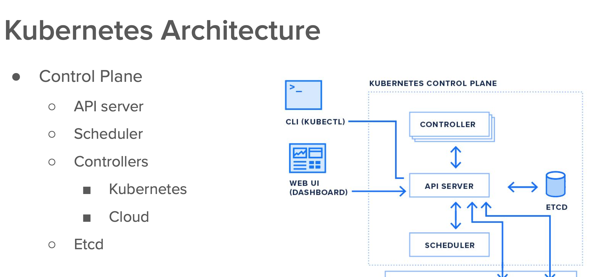

### Revision 


### on client machine location where k8s control plane creds are stored


### controller in k8s 



## Introduction to RC 


### sample RC manifest file 

```
apiVersion: v1
kind: ReplicationController
metadata:
  name: ashu-rc1 # name of my RC 
spec:
  replicas: 1 # number of pod we want 
  template: # pod info 
    metadata:
      labels:
        run: ashupodnew
    spec:
      containers:
      - image: dockerashu/ashu-customer1:releasev1
        name: ashupodnew
        ports:
        - containerPort: 80

```


