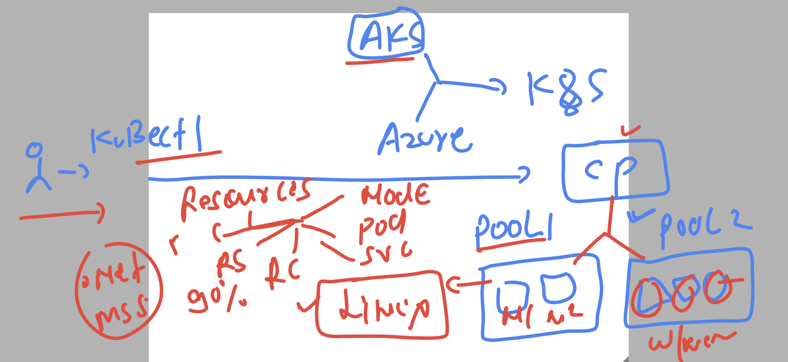
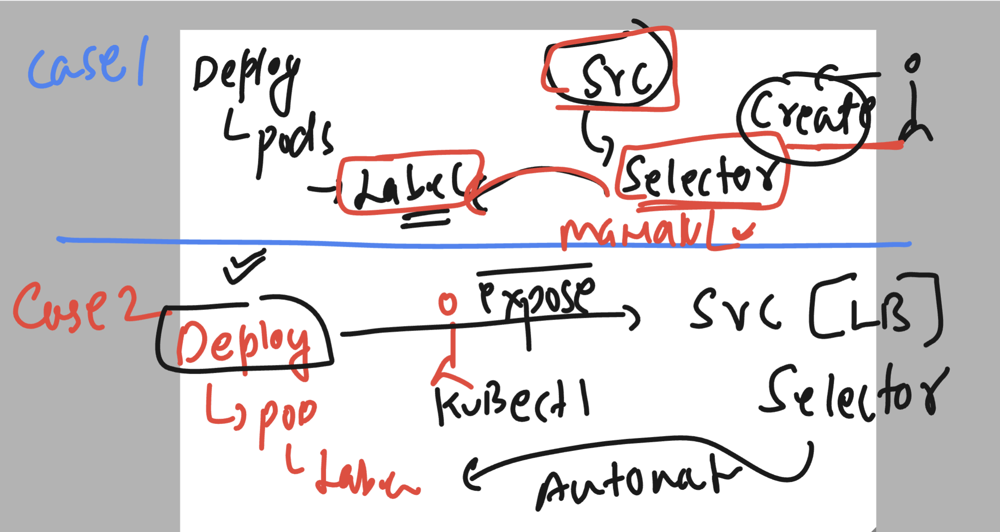
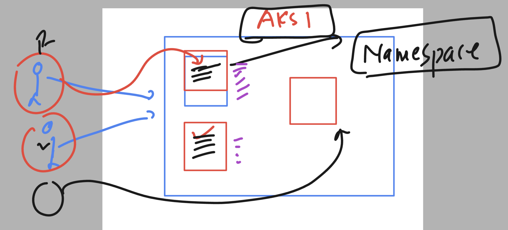
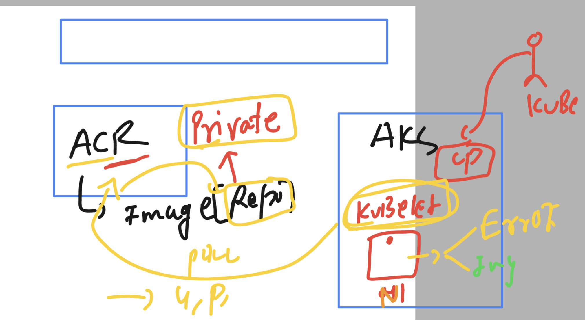

### Revision 



### Deploying a webapp in k8s 

### taking help from kubectl 

```
PS C:\Users\humanfirmware\Desktop\my-yaml-manifest> kubectl  create
Error: must specify one of -f and -k

Create a resource from a file or from stdin.

 JSON and YAML formats are accepted.

Examples:
  # Create a pod using the data in pod.json
  kubectl create -f ./pod.json
  
  # Create a pod based on the JSON passed into stdin
  cat pod.json | kubectl create -f -
  
  # Edit the data in registry.yaml in JSON then create the resource using the edited data
  kubectl create -f registry.yaml --edit -o json

Available Commands:
  clusterrole           Create a cluster role
  clusterrolebinding    Create a cluster role binding for a particular cluster role
  configmap             Create a config map from a local file, directory or literal value
  cronjob               Create a cron job with the specified name
  deployment            Create a deployment with the specified name
  ingress               Create an ingress with the specified name
  job                   Create a job with the sp
```
### using deployment controller manifest 


```
PS C:\Users\humanfirmware\Desktop\my-yaml-manifest> kubectl  create  deployment  ashu-webapp --image=dockerashu/ashu-webui-cloud4c:version35 --port 80 --dry-run=client  -o yaml  
apiVersion: apps/v1
kind: Deployment
metadata:
  creationTimestamp: null
  labels:
    app: ashu-webapp
  name: ashu-webapp
spec:
  replicas: 1
  selector:
    matchLabels:
      app: ashu-webapp
  strategy: {}
  template:
    metadata:
      creationTimestamp: null
      labels:
        app: ashu-webapp
    spec:
      containers:
      - image: dockerashu/ashu-webui-cloud4c:version35
        name: ashu-webui-cloud4c
        ports:
        - containerPort: 80
        resources: {}
status: {}
PS C:\Users\humanfirmware\Desktop\my-yaml-manifest> kubectl  create  deployment  ashu-webapp --image=dockerashu/ashu-webui-cloud4c:version35 --port 80 --dry-run=client  -o yaml  >ashu-deployment.yaml 
```

### lets send create request to control plane 

```
PS C:\Users\humanfirmware\Desktop\my-yaml-manifest> kubectl  create  -f  .\ashu-deployment.yaml                                                      
deployment.apps/ashu-webapp created                                                                                                                  
PS C:\Users\humanfirmware\Desktop\my-yaml-manifest>                                                                                                  
PS C:\Users\humanfirmware\Desktop\my-yaml-manifest> kubectl  get deployment 
NAME          READY   UP-TO-DATE   AVAILABLE   AGE
ashu-webapp   0/1     1            0           7s
PS C:\Users\humanfirmware\Desktop\my-yaml-manifest> 
PS C:\Users\humanfirmware\Desktop\my-yaml-manifest> 
PS C:\Users\humanfirmware\Desktop\my-yaml-manifest> kubectl  get deploy     
NAME          READY   UP-TO-DATE   AVAILABLE   AGE
ashu-webapp   1/1     1            1           11s
PS C:\Users\humanfirmware\Desktop\my-yaml-manifest> 
PS C:\Users\humanfirmware\Desktop\my-yaml-manifest> kubectl  get  pod
NAME                          READY   STATUS    RESTARTS   AGE
ashu-webapp-bc5bdb4b5-89z7h   1/1     Running   0          23s
PS C:\Users\humanfirmware\Desktop\my-yaml-manifest> kubectl  get  pod -o wide
NAME                          READY   STATUS    RESTARTS   AGE   IP           NODE                                NOMINATED NODE   READINESS GATES
ashu-webapp-bc5bdb4b5-89z7h   1/1     Running   0          28s   10.244.1.2   aks-agentpool-18505526-vmss000006   <none>           <none>
PS C:\Users\humanfirmware\Desktop\my-yaml-manifest> 
```

### manual horizental scaling of pods 

```
PS C:\Users\humanfirmware\Desktop\my-yaml-manifest> kubectl  get deploy      
NAME          READY   UP-TO-DATE   AVAILABLE   AGE
ashu-webapp   1/1     1            1           2m38s
PS C:\Users\humanfirmware\Desktop\my-yaml-manifest> 
PS C:\Users\humanfirmware\Desktop\my-yaml-manifest> kubectl  scale  deployment  ashu-webapp --replicas=4
deployment.apps/ashu-webapp scaled
PS C:\Users\humanfirmware\Desktop\my-yaml-manifest> kubectl  get deploy
NAME          READY   UP-TO-DATE   AVAILABLE   AGE
ashu-webapp   3/4     4            3           2m55s
PS C:\Users\humanfirmware\Desktop\my-yaml-manifest> kubectl  get  pods
NAME                          READY   STATUS              RESTARTS   AGE
ashu-webapp-bc5bdb4b5-26zcf   1/1     Running             0          5s
ashu-webapp-bc5bdb4b5-7rjhl   1/1     Running             0          42s
ashu-webapp-bc5bdb4b5-bmncs   0/1     ContainerCreating   0          5s
ashu-webapp-bc5bdb4b5-mzflq   1/1     Running             0          5s
PS C:\Users\humanfirmware\Desktop\my-yaml-manifest> kubectl  get  pods
NAME                          READY   STATUS    RESTARTS   AGE
ashu-webapp-bc5bdb4b5-26zcf   1/1     Running   0          12s
ashu-webapp-bc5bdb4b5-7rjhl   1/1     Running   0          49s
ashu-webapp-bc5bdb4b5-bmncs   1/1     Running   0          12s
```

### creating service -- create vs expose 



### using expose 

```
PS C:\Users\humanfirmware\Desktop\my-yaml-manifest> kubectl get  deploy 
NAME          READY   UP-TO-DATE   AVAILABLE   AGE
ashu-webapp   4/4     4            4           12m
PS C:\Users\humanfirmware\Desktop\my-yaml-manifest> 
PS C:\Users\humanfirmware\Desktop\my-yaml-manifest> 
PS C:\Users\humanfirmware\Desktop\my-yaml-manifest> kubectl  expose  deployment  ashu-webapp  --type LoadBalancer  --port 80 --target-port 80 --name  ashulbnew --dry-run=client -o yaml  >svclbtype.yaml 
PS C:\Users\humanfirmware\Desktop\my-yaml-manifest> 

```

### verify 

```
PS C:\Users\humanfirmware\Desktop\my-yaml-manifest> kubectl create -f  .\svclbtype.yaml   
service/ashulbnew created
PS C:\Users\humanfirmware\Desktop\my-yaml-manifest> 
PS C:\Users\humanfirmware\Desktop\my-yaml-manifest> kubectl  get  service
NAME         TYPE           CLUSTER-IP    EXTERNAL-IP   PORT(S)        AGE
ashulbnew    LoadBalancer   10.0.192.47   <pending>     80:31734/TCP   6s
kubernetes   ClusterIP      10.0.0.1      <none>        443/TCP        20h
PS C:\Users\humanfirmware\Desktop\my-yaml-manifest> kubectl  get  svc    
NAME         TYPE           CLUSTER-IP    EXTERNAL-IP   PORT(S)        AGE
ashulbnew    LoadBalancer   10.0.192.47   <pending>     80:31734/TCP   9s
kubernetes   ClusterIP      10.0.0.1      <none>        443/TCP        20h
PS C:\Users\humanfirmware\Desktop\my-yaml-manifest> 
```
### namespace in k8s 



### default list of ns in aks 

```
PS C:\Users\humanfirmware\Desktop\my-yaml-manifest> kubectl  get  namespaces
NAME              STATUS   AGE
calico-system     Active   3d1h
default           Active   3d1h
kube-node-lease   Active   3d1h
kube-public       Active   3d1h
kube-system       Active   3d1h
tigera-operator   Active   3d1h
```

### creating custom namespaces

```
PS C:\Users\humanfirmware\Desktop\my-yaml-manifest> kubectl create  ns  ashu-project --dry-run=client -o yaml  >ns1.yaml                             
PS C:\Users\humanfirmware\Desktop\my-yaml-manifest>                                                                                                  
PS C:\Users\humanfirmware\Desktop\my-yaml-manifest>                                                                                                  
PS C:\Users\humanfirmware\Desktop\my-yaml-manifest> kubectl create -f ns1.yaml 
namespace/ashu-project created
PS C:\Users\humanfirmware\Desktop\my-yaml-manifest> kubectl get  ns
NAME              STATUS   AGE
ashu-project      Active   2s
calico-system     Active   3d1h
default           Active   3d1h
kube-node-lease   Active   3d1h
kube-public       Active   3d1h
kube-system       Active   3d1h
tigera-operator   Active   3d1h
PS C:\Users\humanfirmware\Desktop\my-yaml-manifest> 
PS C:\Users\humanfirmware\Desktop\my-yaml-manifest> kubectl create  ns  xyz-dbspace                                      
namespace/xyz-dbspace created
PS C:\Users\humanfirmware\Desktop\my-yaml-manifest> kubectl get  ns
NAME              STATUS   AGE
ashu-project      Active   29s
calico-system     Active   3d1h
default           Active   3d1h
kube-node-lease   Active   3d1h
kube-public       Active   3d1h
kube-system       Active   3d1h
```

### to deploy resources in custom namespace there are two ways 

### changing in yaml file

```
apiVersion: apps/v1
kind: Deployment
metadata:
  namespace: ashu-project # defining namespace 
  creationTimestamp: null
  labels:
    app: ashu-webapp
  name: ashu-webapp # name of my deployment 
spec:
  replicas: 1 # number of pods 
  selector:
    matchLabels:
      app: ashu-webapp
  strategy: {} # deployment can have multiple strategy 
  template: # will be used to create pods 
    metadata:
      creationTimestamp: null
      labels: # label of pods 
        app: ashu-webapp
    spec:
      containers:
      - image: dockerashu/ashu-webui-cloud4c:version35
        name: ashu-webui-cloud4c
        ports:
        - containerPort: 80
        resources: {} 
status: {}

```

### lets do it

```
PS C:\Users\humanfirmware\Desktop\my-yaml-manifest> kubectl  create  -f  .\ashu-deployment.yaml  -f  .\lbsvc.yaml  
deployment.apps/ashu-webapp created                                                                                                                  
service/ashu-lb1 created                                                                                                                             
PS C:\Users\humanfirmware\Desktop\my-yaml-manifest>                                                                                                  
PS C:\Users\humanfirmware\Desktop\my-yaml-manifest> kubectl get  deploy                                                                              
No resources found in default namespace.
PS C:\Users\humanfirmware\Desktop\my-yaml-manifest> 
PS C:\Users\humanfirmware\Desktop\my-yaml-manifest> kubectl get  deploy  -n ashu-project 
NAME          READY   UP-TO-DATE   AVAILABLE   AGE
ashu-webapp   1/1     1            1           25s
PS C:\Users\humanfirmware\Desktop\my-yaml-manifest> kubectl get  svc  -n ashu-project    
NAME       TYPE           CLUSTER-IP    EXTERNAL-IP    PORT(S)        AGE
ashu-lb1   LoadBalancer   10.0.174.31   20.207.74.14   80:30013/TCP   33s
PS C:\Users\humanfirmware\Desktop\my-yaml-manifest> 
```

### checking it

```
S C:\Users\humanfirmware\Desktop\my-yaml-manifest> kubectl  delete   -f  .\ashu-deployment.yaml  -f  .\lbsvc.yaml  
deployment.apps "ashu-webapp" deleted
service "ashu-lb1" deleted
```
### we can set custom namespace as default 

```
PS C:\Users\humanfirmware\Desktop\my-yaml-manifest> kubectl  get  ns                                                                                 
NAME              STATUS   AGE                                                                                                                       
ashu-project      Active   11m                                                                                                                       
calico-system     Active   3d1h                                                                                                                      
default           Active   3d1h
kube-node-lease   Active   3d1h
kube-public       Active   3d1h
kube-system       Active   3d1h
tigera-operator   Active   3d1h
xyz-dbspace       Active   11m
PS C:\Users\humanfirmware\Desktop\my-yaml-manifest> kubectl  get  deploy
No resources found in default namespace.
PS C:\Users\humanfirmware\Desktop\my-yaml-manifest> 
PS C:\Users\humanfirmware\Desktop\my-yaml-manifest> kubectl  config set-context --current --namespace=ashu-project 
Context "aks-ashutoshh" modified.
PS C:\Users\humanfirmware\Desktop\my-yaml-manifest> 
PS C:\Users\humanfirmware\Desktop\my-yaml-manifest> kubectl  get  deploy
No resources found in ashu-project namespace.
PS C:\Users\humanfirmware\Desktop\my-yaml-manifest> kubectl  config get-contexts 
CURRENT   NAME                          CLUSTER         AUTHINFO                                 NAMESPACE
*         aks-ashutoshh                 aks-ashutoshh   clusterUser_aks-training_aks-ashutoshh   ashu-project
```

### creating deployment manifest using ACR based image

```
kubectl  create  deployment  ashu-dep1 --image=aksashutoshh.azurecr.io/webapp:version1  --port 80   --dry-run=client -o yaml  >acrimg_deploy.yaml 
```

### deploy it 

```
PS C:\Users\humanfirmware\Desktop\my-yaml-manifest> kubectl  create  -f  .\acrimg_deploy.yaml 
deployment.apps/ashu-dep1 created
PS C:\Users\humanfirmware\Desktop\my-yaml-manifest> 
PS C:\Users\humanfirmware\Desktop\my-yaml-manifest> kubectl  get  deployment  
NAME        READY   UP-TO-DATE   AVAILABLE   AGE
ashu-dep1   0/1     1            0           5s
```

### any private can not deployment in AKS 



### introduction to secret in k8s to store confidential details 


### creating secret manifest file 

```
PS C:\Users\humanfirmware\Desktop\my-yaml-manifest> kubectl  create  secret 
Create a secret with specified type.

 A docker-registry type secret is for accessing a container registry.

 A generic type secret indicate an Opaque secret type.

 A tls type secret holds TLS certificate and its associated key.

Available Commands:
  docker-registry   Create a secret for use with a Docker registry
  generic           Create a secret from a local file, directory, or literal value
  tls               Create a TLS secret
```

### creating it

```
kubectl  create  secret  docker-registry  ashu-reg-cred  --docker-server=aksashutoshh.azurecr.io --docker-username=aksashutoshh    --docker-password="aTgY32ZS2Ri2/8nH0W+ACRBWf0tI"  --dry-run=client -o yaml >acr_cred.yaml

====>
PS C:\Users\humanfirmware\Desktop\my-yaml-manifest> kubectl  create  -f  .\acr_cred.yaml
secret/ashu-reg-cred created
PS C:\Users\humanfirmware\Desktop\my-yaml-manifest> 
PS C:\Users\humanfirmware\Desktop\my-yaml-manifest> 
PS C:\Users\humanfirmware\Desktop\my-yaml-manifest> kubectl  get  secret 
NAME            TYPE                             DATA   AGE
ashu-reg-cred   kubernetes.io/dockerconfigjson   1      9s
PS C:\Users\humanfirmware\Desktop\my-yaml-manifest> 
```
### after manifest update replace it

```
PS C:\Users\humanfirmware\Desktop\my-yaml-manifest> kubectl replace -f  .\acrimg_deploy.yaml  --force
deployment.apps "ashu-dep1" deleted
deployment.apps/ashu-dep1 replaced
PS C:\Users\humanfirmware\Desktop\my-yaml-manifest> 
PS C:\Users\humanfirmware\Desktop\my-yaml-manifest> kubectl  get  deploy
NAME        READY   UP-TO-DATE   AVAILABLE   AGE
ashu-dep1   1/1     1            1           7s
PS C:\Users\humanfirmware\Desktop\my-yaml-manifest> kubectl  get  po    
NAME                         READY   STATUS    RESTARTS   AGE
ashu-dep1-6574d9745d-69n5t   1/1     Running   0          11s
PS C:\Users\humanfirmware\Desktop\my-yaml-manifest> kubectl  get  secret
NAME            TYPE                             DATA   AGE
ashu-reg-cred   kubernetes.io/dockerconfigjson   1      11m
```

