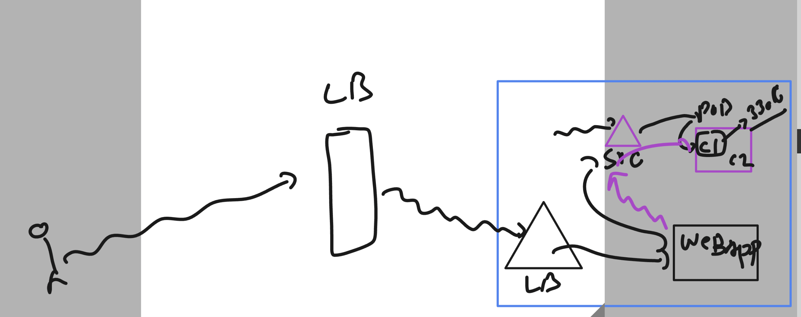

### Revision 


### ephemral nature of container / pod 


### Introduction to Container storage Interface (CSI)


### some CNCF standard project for k8s 


### CSI 


### storage sources 


## Implementing Internal storage in mysql pod 

### pod manifest 
```
apiVersion: v1
kind: Pod
metadata:
  creationTimestamp: null
  labels:
    run: ashudb
  name: ashudb
spec:
  containers:
  - image: mysql:8.01
    name: ashudb
    ports:
    - containerPort: 3306
    resources: {}
  dnsPolicy: ClusterFirst
  restartPolicy: Always
status: {}
```
### updating with emptyDir volume 

```
apiVersion: v1
kind: Pod
metadata:
  creationTimestamp: null
  labels:
    run: ashudb
  name: ashudb
spec:
  volumes: # to create volumes 
  - name: ashu-volume1 
    emptyDir: {} # k8s nodes will give a random directory inside them 
  containers: # to create contaienrs 
  - image: mysql:8.01
    name: ashudb
    ports:
    - containerPort: 3306
    resources: {}
    volumeMounts: # to mount volume inside pod container 
    - name: ashu-volume1 
      mountPath: /var/lib/mysql/ 
  dnsPolicy: ClusterFirst
  restartPolicy: Always
status: {}
```

### final mysql yaml 

```
apiVersion: v1
kind: Pod
metadata:
  creationTimestamp: null
  labels:
    run: ashudb
  name: ashudb
spec:
  volumes: # to create volumes 
  - name: ashu-volume1 
    emptyDir: {} # k8s nodes will give a random directory inside them 
  containers: # to create contaienrs 
  - image: mysql:8.0
    name: ashudb
    ports:
    - containerPort: 3306
    resources: {}
    env: 
    - name: MYSQL_ROOT_PASSWORD
      value: RedDb@1234
    volumeMounts: # to mount volume inside pod container 
    - name: ashu-volume1 
      mountPath: /var/lib/mysql/ 
  dnsPolicy: ClusterFirst
  restartPolicy: Always
status: {}
```

### deploy it 

```
PS C:\Users\humanfirmware\Desktop\my-yaml-manifest\storage-apps> kubectl replace -f  .\pod1.yaml --force
pod "ashudb" deleted
pod/ashudb replaced
PS C:\Users\humanfirmware\Desktop\my-yaml-manifest\storage-apps> kubectl get  pods  
NAME     READY   STATUS    RESTARTS   AGE
ashudb   1/1     Running   0          6s
PS C:\Users\humanfirmware\Desktop\my-yaml-manifest\storage-apps> 

```

### accessing database pod 

```
PS C:\Users\humanfirmware\Desktop\my-yaml-manifest\storage-apps> kubectl get  pods        
NAME     READY   STATUS    RESTARTS   AGE
ashudb   1/1     Running   0          2m2s
PS C:\Users\humanfirmware\Desktop\my-yaml-manifest\storage-apps> 
PS C:\Users\humanfirmware\Desktop\my-yaml-manifest\storage-apps> 
PS C:\Users\humanfirmware\Desktop\my-yaml-manifest\storage-apps> 
PS C:\Users\humanfirmware\Desktop\my-yaml-manifest\storage-apps> 
PS C:\Users\humanfirmware\Desktop\my-yaml-manifest\storage-apps> kubectl  exec -it  ashudb -- bash 
bash-4.4#
bash-4.4# 
bash-4.4# 
bash-4.4# mysql -u root -p
Enter password: 
ERROR 1045 (28000): Access denied for user 'root'@'localhost' (using password: YES)
bash-4.4# mysql -u root -pRedDb@1234
mysql: [Warning] Using a password on the command line interface can be insecure.
Welcome to the MySQL monitor.  Commands end with ; or \g.
Your MySQL connection id is 9
Server version: 8.0.34 MySQL Community Server - GPL

Copyright (c) 2000, 2023, Oracle and/or its affiliates.

Oracle is a registered trademark of Oracle Corporation and/or its
affiliates. Other names may be trademarks of their respective
owners.

Type 'help;' or '\h' for help. Type '\c' to clear the current input statement.

mysql> show databases;
+--------------------+
| Database           |
+--------------------+
| information_schema |
| mysql              |
| performance_schema |
| sys                |
+--------------------+
4 rows in set (0.00 sec)

mysql> create database hello;
Query OK, 1 row affected (0.02 sec)

mysql> show databases;
+--------------------+
| Database           |
+--------------------+
| hello              |
| information_schema |
| mysql              |
| performance_schema |
| sys                |
+--------------------+
5 rows in set (0.00 sec)

mysql> exit;
Bye
bash-4.4# exit
exit
PS C:\Users\humanfirmware\Desktop\my-yaml-manifest\storage-apps> 
```

### understanding usage of multi container pod 


### demo of deployment with single volume and single container 

```
apiVersion: apps/v1
kind: Deployment
metadata:
  creationTimestamp: null
  labels:
    app: ashudb
  name: ashudb
spec:
  replicas: 1
  selector:
    matchLabels:
      app: ashudb
  strategy: {}
  template: # pod template
    metadata:
      creationTimestamp: null
      labels:
        app: ashudb
    spec:
      volumes: 
      - name: ashu-dbvol
        hostPath:  # is for defining storage options in nodes 
          path: /ashu/data
          type: DirectoryOrCreate 
      containers:
      - image: mysql:8.0
        name: mysql
        ports:
        - containerPort: 3306
        resources: {}
        volumeMounts: # mounting volume created above 
        - name: ashu-dbvol 
          mountPath: /var/lib/mysql/ # default mysql db location 
        env: 
        - name: MYSQL_ROOT_PASSWORD
          value: RedDb@1234
status: {}

```

### deploy it

```
PS C:\Users\humanfirmware\Desktop\my-yaml-manifest\storage-apps> kubectl  create -f .\db_deploy.yaml                                                 deployment.apps/ashudb created                                                                                                             PS C:\Users\humanfirmware\Desktop\my-yaml-manifest\storage-apps>                                                                                PS C:\Users\humanfirmware\Desktop\my-yaml-manifest\storage-apps> kubectl.exe  get  pod
NAME                      READY   STATUS    RESTARTS   AGE
ashudb-7d78fbd578-t7ckt   1/1     Running   0          4s
```

### adding another container

```
apiVersion: apps/v1
kind: Deployment
metadata:
  creationTimestamp: null
  labels:
    app: ashudb
  name: ashudb
spec:
  replicas: 1
  selector:
    matchLabels:
      app: ashudb
  strategy: {}
  template: # pod template
    metadata:
      creationTimestamp: null
      labels:
        app: ashudb
    spec:
      volumes: 
      - name: ashu-dbvol
        hostPath:  # is for defining storage options in nodes 
          path: /ashu/data
          type: DirectoryOrCreate 
      containers:
      - image: alpine 
        name: ashuc1 
        command: ['sh','-c','sleep 10000'] 
        volumeMounts: 
        - name: ashu-dbvol 
          mountPath: /mnt/data
          readOnly: True 
      - image: mysql:8.0
        name: mysql
        ports:
        - containerPort: 3306
        resources: {}
        volumeMounts: # mounting volume created above 
        - name: ashu-dbvol 
          mountPath: /var/lib/mysql/ # default mysql db location 
        env: 
        - name: MYSQL_ROOT_PASSWORD
          value: RedDb@1234
status: {}

```

### deploy it

```
PS C:\Users\humanfirmware\Desktop\my-yaml-manifest\storage-apps> kubectl replace -f .\db_deploy.yaml
deployment.apps/ashudb replaced
PS C:\Users\humanfirmware\Desktop\my-yaml-manifest\storage-apps> kubectl get  pod
NAME                     READY   STATUS    RESTARTS   AGE
ashudb-68656bb49-c562r   2/2     Running   0          35s
PS C:\Users\humanfirmware\Desktop\my-yaml-manifest\storage-apps> kubectl.exe  get  deploy
NAME     READY   UP-TO-DATE   AVAILABLE   AGE
ashudb   1/1     1            1           8m12s
```

### creating clusterIP type service for DB pod 

```
PS C:\Users\humanfirmware\Desktop\my-yaml-manifest\storage-apps> kubectl.exe   get  deploy                                                           
NAME     READY   UP-TO-DATE   AVAILABLE   AGE                                                                                                        
ashudb   1/1     1            1           11m                                                                                                        
PS C:\Users\humanfirmware\Desktop\my-yaml-manifest\storage-apps>                                                                                     
PS C:\Users\humanfirmware\Desktop\my-yaml-manifest\storage-apps> kubectl expose deploy  ashudb --type ClusterIP --port 3306 --name dblb1 --dry-run=client  -o yaml >dbsvc.yaml 
PS C:\Users\humanfirmware\Desktop\my-yaml-manifest\storage-apps> kubectl create -f .\dbsvc.yaml
service/dblb1 created
PS C:\Users\humanfirmware\Desktop\my-yaml-manifest\storage-apps> kubectl get svc
NAME    TYPE        CLUSTER-IP    EXTERNAL-IP   PORT(S)    AGE
dblb1   ClusterIP   10.0.29.223   <none>        3306/TCP   11s
PS C:\Users\humanfirmware\Desktop\my-yaml-manifest\storage-apps> kubectl get ep 
NAME    ENDPOINTS         AGE
dblb1   10.244.2.9:3306   17s
PS C:\Users\humanfirmware\Desktop\my-yaml-manifest\storage-apps> 

```

### creating web app 



### creating it

```
PS C:\Users\humanfirmware\Desktop\my-yaml-manifest\storage-apps> kubectl  create  deployment  ashu-webapp --image=adminer  --port 8080 --dry-run=client -o yaml >web_deploy.yaml 
PS C:\Users\humanfirmware\Desktop\my-yaml-manifest\storage-apps> 
PS C:\Users\humanfirmware\Desktop\my-yaml-manifest\storage-apps> kubectl create -f .\web_deploy.yaml
deployment.apps/ashu-webapp created
PS C:\Users\humanfirmware\Desktop\my-yaml-manifest\storage-apps> 
PS C:\Users\humanfirmware\Desktop\my-yaml-manifest\storage-apps> kubectl get  deploy
NAME          READY   UP-TO-DATE   AVAILABLE   AGE
ashu-webapp   0/1     1            0           5s
ashudb        1/1     1            1           17m
PS C:\Users\humanfirmware\Desktop\my-yaml-manifest\storage-apps> kubectl get  po    
NAME                           READY   STATUS              RESTARTS   AGE
ashu-webapp-6ccf6f7765-ptqkt   0/1     ContainerCreating   0          9s
ashudb-68656bb49-c562r         2/2     Running             0          9m52s
PS C:\Users\humanfirmware\Desktop\my-yaml-manifest\storage-apps> kubectl get  po
NAME                           READY   STATUS    RESTARTS   AGE
ashu-webapp-6ccf6f7765-ptqkt   1/1     Running   0          14s
ashudb-68656bb49-c562r         2/2     Running   0          9m57s
```

### exposing webapp with Loadbalancer type service

```
PS C:\Users\humanfirmware\Desktop\my-yaml-manifest\storage-apps> kubectl get  deploy
NAME          READY   UP-TO-DATE   AVAILABLE   AGE
ashu-webapp   1/1     1            1           4m6s
ashudb        1/1     1            1           21m
PS C:\Users\humanfirmware\Desktop\my-yaml-manifest\storage-apps> 
PS C:\Users\humanfirmware\Desktop\my-yaml-manifest\storage-apps> 
PS C:\Users\humanfirmware\Desktop\my-yaml-manifest\storage-apps> kubectl  expose  deployment  ashu-webapp --type LoadBalancer --port 8080 --name ashu-weblb --dry-run=client  -o yaml   >websvc.yaml 
PS C:\Users\humanfirmware\Desktop\my-yaml-manifest\storage-apps> kubectl  create -f .\websvc.yaml
service/ashu-weblb created
PS C:\Users\humanfirmware\Desktop\my-yaml-manifest\storage-apps> 
PS C:\Users\humanfirmware\Desktop\my-yaml-manifest\storage-apps> kubectl get  svc
NAME         TYPE           CLUSTER-IP    EXTERNAL-IP   PORT(S)          AGE
ashu-weblb   LoadBalancer   10.0.45.250   <pending>     8080:30019/TCP   5s
dblb1        ClusterIP      10.0.29.223   <none>        3306/TCP         9m26s
PS C:\Users\humanfirmware\Desktop\my-yaml-manifest\storage-apps> 


```
