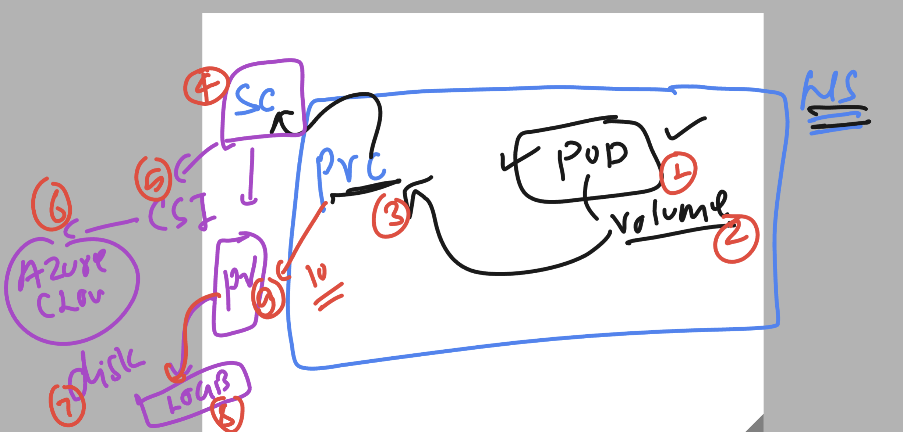

## REvision 

### step 1 -- APp containerization using docker or any CR


### step 2 setup aks and start sending request to control plane API server


### step 3 -- revision understanding apiresource and their manifesting 


### final step -- to revsion 


### understanding pv and pvc concept 


### AKS with storageclass 


### Implementing DYnamic storage 

### cleaning all the namespace component 

```
PS C:\Users\humanfirmware\Desktop\my-yaml-manifest> kubectl  delete all,cm,secret,ingress   --all
pod "ashu-webapp-6ccf6f7765-b226l" deleted
pod "ashudb-68656bb49-ggdmj" deleted
service "dblb1" deleted
service "weblb" deleted
deployment.apps "ashu-webapp" deleted
deployment.apps "ashudb" deleted
configmap "kube-root-ca.crt" deleted
ingress.networking.k8s.io "ashu-app-routing-rule" deleted

```

## Making Database deployment work

### creating storage class first 

```
apiVersion:  storage.k8s.io/v1
kind: StorageClass
metadata:
  name: ashu-azure-storageclass # name of sc 
provisioner: disk.csi.azure.com # csi driver to connect azure Disk 
parameters:
  skuName: Premium_ZRS
reclaimPolicy: Retain # if disk got free then other pod can use it 
volumeBindingMode: WaitForFirstConsumer # wait disk to be created when some pod is calling
allowVolumeExpansion: true
```

### creating it 

```
PS C:\Users\humanfirmware\Desktop\my-yaml-manifest> cd .\storage-apps\
PS C:\Users\humanfirmware\Desktop\my-yaml-manifest\storage-apps> 
PS C:\Users\humanfirmware\Desktop\my-yaml-manifest\storage-apps> kubectl  create -f .\mystorage_class.yaml  
storageclass.storage.k8s.io/ashu-azure-storageclass created
PS C:\Users\humanfirmware\Desktop\my-yaml-manifest\storage-apps> kubectl get  sc
NAME                      PROVISIONER          RECLAIMPOLICY   VOLUMEBINDINGMODE      ALLOWVOLUMEEXPANSION   AGE
ashu-azure-storageclass   disk.csi.azure.com   Retain          WaitForFirstConsumer   true                   5s
azurefile                 file.csi.azure.com   Delete          Immediate              true                   9d
azurefile-csi             file.csi.azure.com   Delete          Immediate              true                   9d
azurefile-csi-premium     file.csi.azure.com   Delete          Immediate              true                   9d
```

### create pvc and point it above Storage class we  created 

```
apiVersion: v1
kind: PersistentVolumeClaim
metadata:
  name: ashu-db-diskpvc
spec:
  accessModes:
  - ReadWriteOnce # only single node can do read and write 
  storageClassName: ashu-azure-storageclass
  resources:
    requests:
      storage: 10Gi # my for database i want 10Gb space 
```

### creating it 

```
PS C:\Users\humanfirmware\Desktop\my-yaml-manifest\storage-apps> kubectl create -f .\pvc.yaml 
persistentvolumeclaim/ashu-db-diskpvc created
PS C:\Users\humanfirmware\Desktop\my-yaml-manifest\storage-apps> kubectl get  pvc
NAME              STATUS    VOLUME   CAPACITY   ACCESS MODES   STORAGECLASS              AGE
ashu-db-diskpvc   Pending                                      ashu-azure-storageclass   4s
PS C:\Users\humanfirmware\Desktop\my-yaml-manifest\storage-apps> 


```

### creating Deployment and using pvc as volume 

```
apiVersion: apps/v1
kind: Deployment
metadata:
  creationTimestamp: null
  labels:
    app: ashudb
  name: ashudb
spec:
  replicas: 1
  selector:
    matchLabels:
      app: ashudb
  strategy: {}
  template: # pod template
    metadata:
      creationTimestamp: null
      labels:
        app: ashudb
    spec:
      volumes: 
      - name: ashu-dbvol
        persistentVolumeClaim:  # calling pvc which we created 
          claimName: ashu-db-diskpvc # name of already created PVC 
      containers:
      - image: alpine 
        name: ashuc1 
        command: ['sh','-c','sleep 10000'] 
        volumeMounts: 
        - name: ashu-dbvol 
          mountPath: /mnt/data
          readOnly: True 
      - image: mysql:8.0
        name: mysql
        ports:
        - containerPort: 3306
        resources: {}
        volumeMounts: # mounting volume created above 
        - name: ashu-dbvol 
          mountPath: /var/lib/mysql/ # default mysql db location 
        env: 
        - name: MYSQL_ROOT_PASSWORD
          value: RedDb@1234
status: {}

```

### creating it ...

```

PS C:\Users\humanfirmware\Desktop\my-yaml-manifest\storage-apps> kubectl  create -f .\mystorage_class.yaml  
storageclass.storage.k8s.io/ashu-azure-storageclass created
PS C:\Users\humanfirmware\Desktop\my-yaml-manifest\storage-apps> kubectl create -f .\db_deploy.yaml 
deployment.apps/ashudb created
PS C:\Users\humanfirmware\Desktop\my-yaml-manifest\storage-apps> kubectl.exe  get  deploy                                            NAME     READY   UP-TO-DATE   AVAILABLE   AGE                                                                                        ashudb   0/1     1            0           4s                                                                                         PS C:\Users\humanfirmware\Desktop\my-yaml-manifest\storage-apps> kubectl  get  po                                                    
NAME                      READY   STATUS              RESTARTS   AGE
ashudb-7b6cc6656b-s5jrg   0/2     ContainerCreating   0          11s
PS C:\Users\humanfirmware\Desktop\my-yaml-manifest\storage-apps> kubectl  get  po
NAME                      READY   STATUS              RESTARTS   AGE
ashudb-7b6cc6656b-s5jrg   0/2     ContainerCreating   0          16s
PS C:\Users\humanfirmware\Desktop\my-yaml-manifest\storage-apps> 
PS C:\Users\humanfirmware\Desktop\my-yaml-manifest\storage-apps> kubectl  get  po
NAME                      READY   STATUS    RESTARTS   AGE
ashudb-7b6cc6656b-s5jrg   2/2     Running   0          27s
=========>>

PS C:\Users\humanfirmware\Desktop\my-yaml-manifest\storage-apps> kubectl get  pvc
NAME              STATUS   VOLUME                                     CAPACITY   ACCESS MODES   STORAGECLASS              AGE
ashu-db-diskpvc   Bound    pvc-abef8d06-2446-4f40-a1f8-2767011c3c3b   10Gi       RWO            ashu-azure-storageclass   8m35s      
PS C:\Users\humanfirmware\Desktop\my-yaml-manifest\storage-apps>
PS C:\Users\humanfirmware\Desktop\my-yaml-manifest\storage-apps>
PS C:\Users\humanfirmware\Desktop\my-yaml-manifest\storage-apps>
PS C:\Users\humanfirmware\Desktop\my-yaml-manifest\storage-apps> 
PS C:\Users\humanfirmware\Desktop\my-yaml-manifest\storage-apps> kubectl get  pv 
NAME                                       CAPACITY   ACCESS MODES   RECLAIM POLICY   STATUS   CLAIM                          STORAGECLASS              REASON   AGE
pvc-abef8d06-2446-4f40-a1f8-2767011c3c3b   10Gi       RWO            Retain           Bound    ashu-project/ashu-db-diskpvc   ashu-azure-storageclass            59s
```

### Explanation of above storage class 



## HPA deployment -- Horizental pod autoscaller 

### creating deployment 
```
apiVersion: apps/v1
kind: Deployment
metadata:
  creationTimestamp: null
  labels:
    app: ashu-web
  name: ashu-web
spec:
  replicas: 1
  selector:
    matchLabels:
      app: ashu-web
  strategy: {}
  template:
    metadata:
      creationTimestamp: null
      labels:
        app: ashu-web
    spec:
      containers:
      - image: dockerashu/ashu-webui-cloud4c:version35
        name: ashu-webui-cloud4c
        ports:
        - containerPort: 80
        resources: {}
status: {}
```

### HPA usage metric server to read pod resource consumption and AKS is having it default

```
PS C:\Users\humanfirmware> kubectl  get  po  -n kube-system
NAME                                  READY   STATUS    RESTARTS   AGE
ama-logs-f8mlx                        3/3     Running   0          140m
ama-logs-q8jzs                        3/3     Running   0          140m
ama-logs-rs-769cdf78d7-nl4xr          2/2     Running   0          3h34m
ama-metrics-54f59d4b7c-7w6d6          2/2     Running   0          140m
ama-metrics-ksm-9fcd9bbf4-fxwm6       1/1     Running   0          140m
ama-metrics-node-c8j8q                2/2     Running   0          140m
ama-metrics-node-tlr82                2/2     Running   0          140m
cloud-node-manager-glsph              1/1     Running   0          140m
cloud-node-manager-p27nt              1/1     Running   0          140m
coredns-76b9877f49-kgm9v              1/1     Running   0          3h34m
coredns-76b9877f49-mzh8v              1/1     Running   0          3h34m
coredns-autoscaler-85f7d6b75d-mbzbp   1/1     Running   0          3h34m
csi-azuredisk-node-lrprf              3/3     Running   0          140m
csi-azuredisk-node-qljvp              3/3     Running   0          140m
csi-azurefile-node-57ghr              3/3     Running   0          140m
csi-azurefile-node-rxqrq              3/3     Running   0          140m
konnectivity-agent-7b9b474ff5-n6n9n   1/1     Running   0          3h34m
konnectivity-agent-7b9b474ff5-pkbcg   1/1     Running   0          3h34m
kube-proxy-dbbfs                      1/1     Running   0          140m
kube-proxy-wjrkf                      1/1     Running   0          140m
metrics-server-555d76c778-46fch       2/2     Running   0          3h34m
metrics-server-555d76c778-rmvlw       2/2     Running   0          3h34m
```

### updating deployment manifest file

```
apiVersion: apps/v1
kind: Deployment
metadata:
  creationTimestamp: null
  labels:
    app: ashu-web
  name: ashu-web
spec:
  replicas: 1
  selector:
    matchLabels:
      app: ashu-web
  strategy: {}
  template:
    metadata:
      creationTimestamp: null
      labels:
        app: ashu-web
    spec:
      containers:
      - image: dockerashu/ashu-webui-cloud4c:version35
        name: ashu-webui-cloud4c
        ports:
        - containerPort: 80
        resources:  # no limit in pod container 
          requests:
            memory: 50M
            cpu: 10m # 1 vcpu == 1000 m (milicore)
          limits:
            memory: 600M 
            cpu: 300m # 30% of 1vcpu -- that virtual cpu core 
status: {}
```

### deploy it 

```
PS C:\Users\humanfirmware\Desktop\my-yaml-manifest\final_day> kubectl create -f .\deployment.yaml
deployment.apps/ashu-web created
PS C:\Users\humanfirmware\Desktop\my-yaml-manifest\final_day> kubectl.exe get  deploy                                                                               
NAME       READY   UP-TO-DATE   AVAILABLE   AGE                                                                                                                     
ashu-web   0/1     1            0           7s                                                                                                                      
PS C:\Users\humanfirmware\Desktop\my-yaml-manifest\final_day> kubectl.exe get  po                                                                                   
NAME                        READY   STATUS    RESTARTS   AGE
ashu-web-587dc98f7d-sn5jj   1/1     Running   0          11s
```

### creating cluster IP type service

```
PS C:\Users\humanfirmware\Desktop\my-yaml-manifest\final_day> kubectl create -f .\deployment.yaml
deployment.apps/ashu-web created
PS C:\Users\humanfirmware\Desktop\my-yaml-manifest\final_day> kubectl.exe get  deploy
NAME       READY   UP-TO-DATE   AVAILABLE   AGE
ashu-web   0/1     1            0           7s
PS C:\Users\humanfirmware\Desktop\my-yaml-manifest\final_day> kubectl.exe get  po
NAME                        READY   STATUS    RESTARTS   AGE
ashu-web-587dc98f7d-sn5jj   1/1     Running   0          11s
PS C:\Users\humanfirmware\Desktop\my-yaml-manifest\final_day>
PS C:\Users\humanfirmware\Desktop\my-yaml-manifest\final_day> 
PS C:\Users\humanfirmware\Desktop\my-yaml-manifest\final_day> kubectl  expose deployment  ashu-web --type ClusterIP --port 80 --name lbweb 
service/lbweb exposed
PS C:\Users\humanfirmware\Desktop\my-yaml-manifest\final_day> kubectl get  svc
NAME    TYPE        CLUSTER-IP     EXTERNAL-IP   PORT(S)   AGE
lbweb   ClusterIP   10.0.216.147   <none>        80/TCP    7s
PS C:\Users\humanfirmware\Desktop\my-yaml-manifest\final_day> kubectl get  ep 
NAME    ENDPOINTS        AGE
lbweb   10.244.1.12:80   12s
```

### deploy HPA rule in deployment pod 

```
PS C:\Users\humanfirmware\Desktop\my-yaml-manifest\final_day> kubectl get deploy 
NAME       READY   UP-TO-DATE   AVAILABLE   AGE
ashu-web   1/1     1            1           25m
PS C:\Users\humanfirmware\Desktop\my-yaml-manifest\final_day> 
PS C:\Users\humanfirmware\Desktop\my-yaml-manifest\final_day> 
PS C:\Users\humanfirmware\Desktop\my-yaml-manifest\final_day> kubectl  autoscale  deployment  ashu-web --cpu-percent 10 --max 10 --min 2 
horizontalpodautoscaler.autoscaling/ashu-web autoscaled
PS C:\Users\humanfirmware\Desktop\my-yaml-manifest\final_day> kubectl  get  hpa
NAME       REFERENCE             TARGETS         MINPODS   MAXPODS   REPLICAS   AGE
ashu-web   Deployment/ashu-web   <unknown>/10%   2         10        0          5s
PS C:\Users\humanfirmware\Desktop\my-yaml-manifest\final_day> 

```

## Helm 

### checking list of repo in you k8s client machine 

```
PS C:\Users\humanfirmware> helm  repo list
NAME            URL
ingress-nginx   https://kubernetes.github.io/ingress-nginx
PS C:\Users\humanfirmware>

```

### adding a new repo 

```
PS C:\Users\humanfirmware> helm repo add  ashu-repo   https://prometheus-community.github.io/helm-charts
"ashu-repo" has been added to your repositories
PS C:\Users\humanfirmware>
PS C:\Users\humanfirmware> helm  repo list
NAME            URL
ingress-nginx   https://kubernetes.github.io/ingress-nginx
ashu-repo       https://prometheus-community.github.io/helm-charts
PS C:\Users\humanfirmware>


```

### its a good way to always keep your repo updated

```
PS C:\Users\humanfirmware> helm repo update
Hang tight while we grab the latest from your chart repositories...
...Successfully got an update from the "ingress-nginx" chart repository
...Successfully got an update from the "ashu-repo" chart repository
Update Complete. ⎈Happy Helming!⎈
```

### installing prometheus and grafan using helm 

```
PS C:\Users\humanfirmware> helm repo list
NAME            URL
ingress-nginx   https://kubernetes.github.io/ingress-nginx
ashu-repo       https://prometheus-community.github.io/helm-charts
PS C:\Users\humanfirmware>
PS C:\Users\humanfirmware>
PS C:\Users\humanfirmware> helm  search repo  kube
NAME                                    CHART VERSION   APP VERSION     DESCRIPTION
ashu-repo/kube-prometheus-stack         51.0.3          v0.68.0         kube-prometheus-stack collects Kubernetes manif...
ashu-repo/kube-state-metrics            5.13.0          2.10.0          Install kube-state-metrics to generate and expo...
ashu-repo/jiralert                      1.6.0           v1.3.0          A Helm chart for Kubernetes to install jiralert
ashu-repo/prometheus                    2.0.4                           A Prometheus Helm chart for Kubernetes. Prometh...
ashu-repo/prometheus-operator           9.3.1           0.38.1          Provides easy monitoring definitions for Kubern...
ashu-repo/prometheus-smartctl-exporter  0.6.0           v0.11.0         A Helm chart for Kubernetes
ingress-nginx/ingress-nginx             4.7.2           1.8.2           Ingress controller for Kubernetes using NGINX a...
ashu-repo/prometheus-druid-exporter     1.1.0           v0.11.0         Druid exporter to monitor druid metrics with Pr...
PS C:\Users\humanfirmware>
PS C:\Users\humanfirmware>
PS C:\Users\humanfirmware>
PS C:\Users\humanfirmware> helm install ashu-monitoring   ashu-repo/kube-prometheus-stack  -n watch-apps

```

### checking status

```
PS C:\Users\humanfirmware> helm install ashu-monitoring   ashu-repo/kube-prometheus-stack  -n watch-apps
NAME: ashu-monitoring
LAST DEPLOYED: Thu Sep 21 13:54:31 2023
NAMESPACE: watch-apps
STATUS: deployed
REVISION: 1
NOTES:
kube-prometheus-stack has been installed. Check its status by running:
  kubectl --namespace watch-apps get pods -l "release=ashu-monitoring"

Visit https://github.com/prometheus-operator/kube-prometheus for instructions on how to create & configure Alertmanager and Prometheus instances using the Operator.
PS C:\Users\humanfirmware>
PS C:\Users\humanfirmware>

====>

PS C:\Users\humanfirmware> helm list -n watch-apps
NAME            NAMESPACE       REVISION        UPDATED                                 STATUS          CHART                           APP VERSION
ashu-monitoring watch-apps      1               2023-09-21 13:54:31.0466457 +0530 IST   deployed        kube-prometheus-stack-51.0.3    v0.68.0
PS C:\Users\humanfirmware>
PS C:\Users\humanfirmware>
```

### verify it using kubectl also 

```


```

