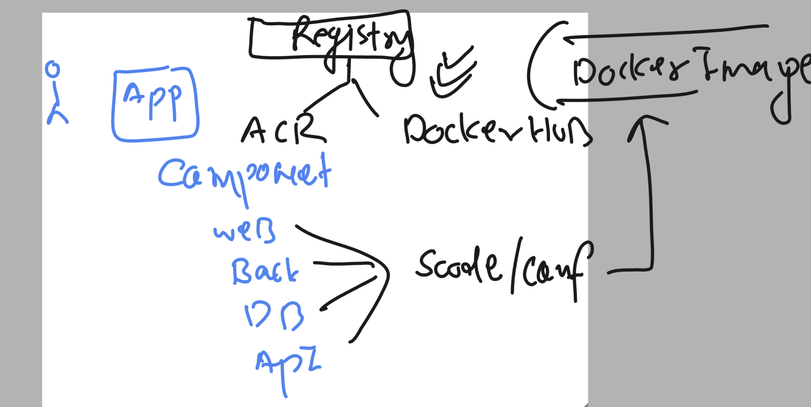
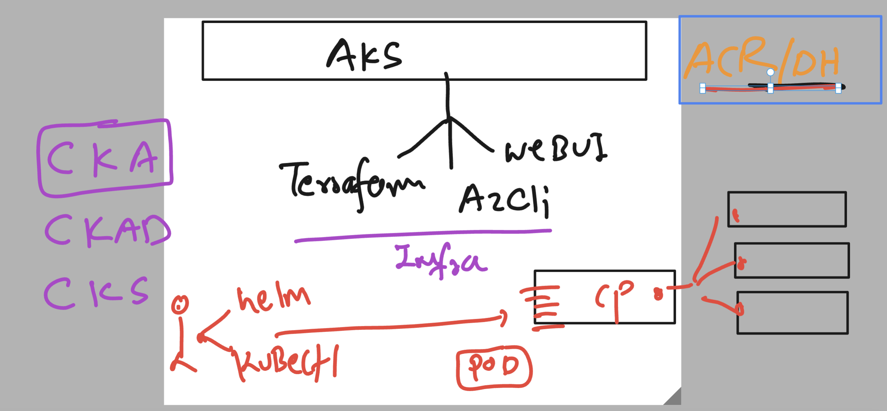
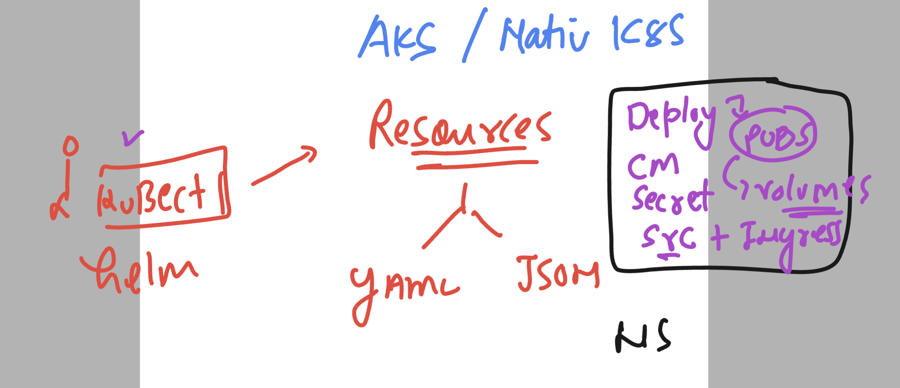
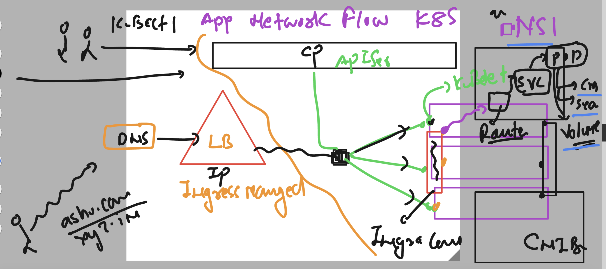
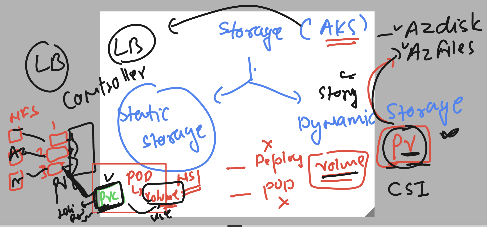
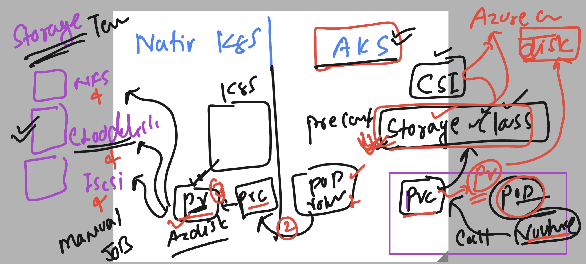

## REvision 

### step 1 -- APp containerization using docker or any CR

### step 2 setup aks and start sending request to control plane API server

### step 3 -- revision understanding apiresource and their manifesting 

### final step -- to revsion 

### understanding pv and pvc concept 

### AKS with storageclass 

